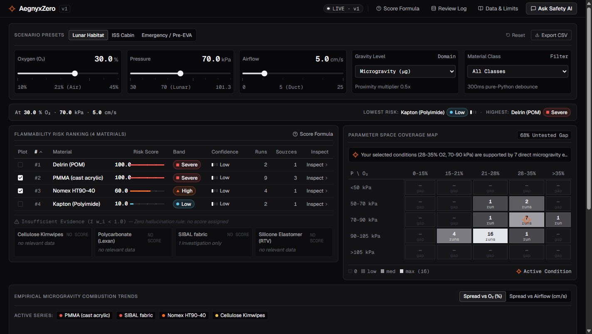
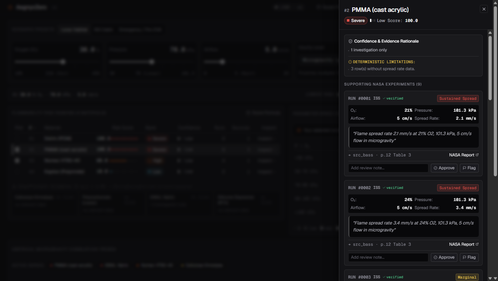
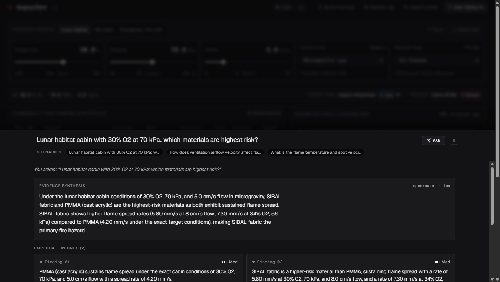
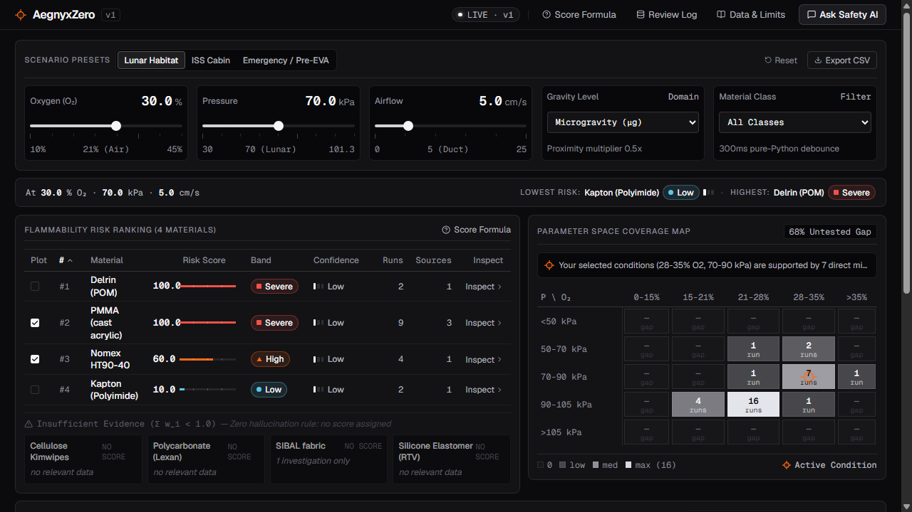
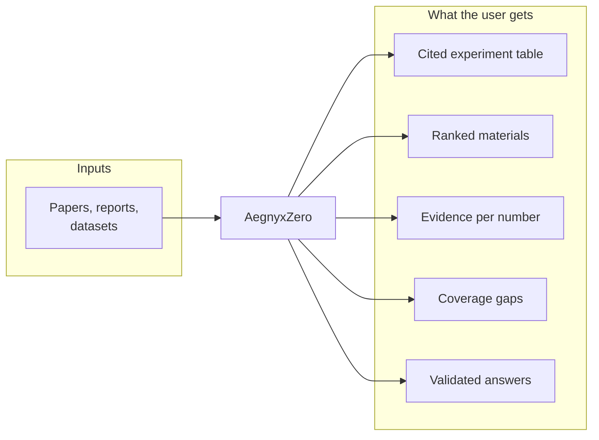
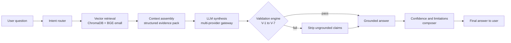
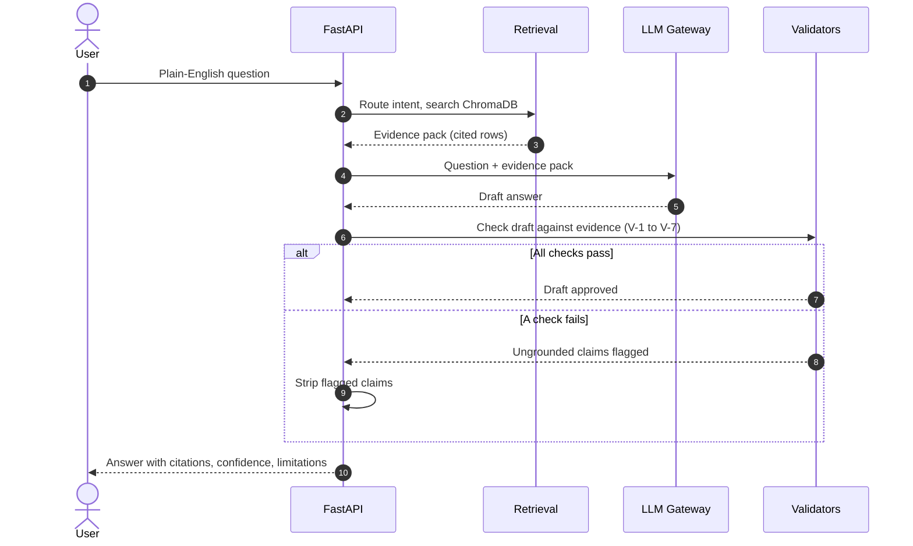
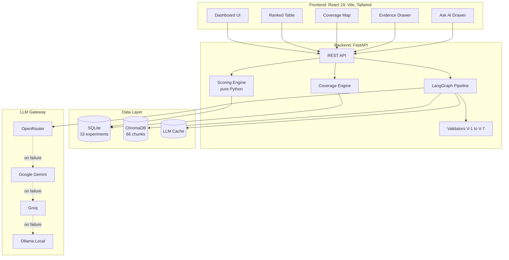
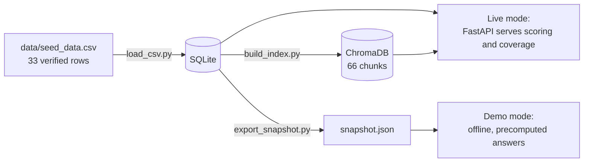
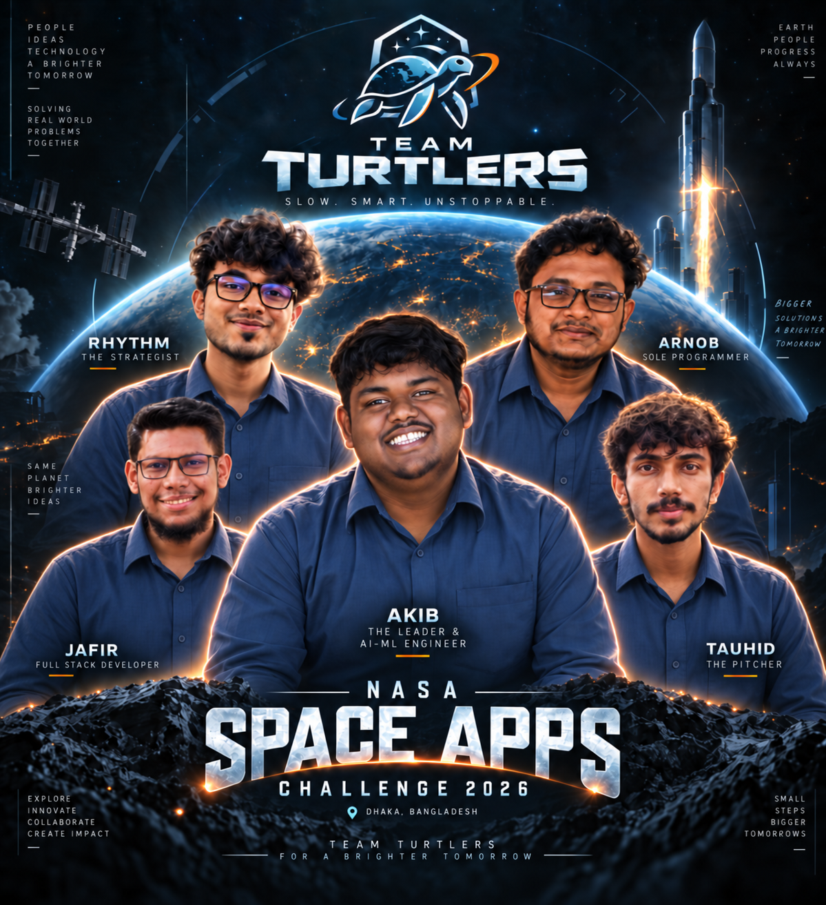

<div align="center">

# AegnyxZero

### Evidence-first fire safety for human spaceflight

*From the Latin* ***Aegis*** *(shield) +* ***Ignis*** *(fire) +* ***Zero*** *(zero gravity)*

[](https://www.spaceappschallenge.org/)
[]()
[]()
[](./LICENSE)
[](https://www.python.org/)
[](https://react.dev/)

Built by Team Turtlers for the NASA Space Apps Challenge 2026 (Dhaka Local Event)

[Problem](#the-problem) · [Solution](#the-solution) · [Demo](#live-demo) · [How It Works](#how-it-works) · [Architecture](#architecture) · [Quick Start](#quick-start) · [Team](#team-turtlers)

</div>

---

## Screenshots & Interface Walkthrough

### Main Decision Instrument & Risk Ranking


### Key Operational Phases

| Phase 1: Evidence Verification Drawer | Phase 2: Grounded Ask AI (V-1 to V-7 Checks) |
|:---:|:---:|
|  |  |
| *Deep-dive into contributing NASA experiments, exact page citations, and raw source quotes.* | *Plain-English synthesis guarded by deterministic validators that strip hallucinated numbers.* |

<p align="center">
  
  <br/>
  <em>Designed for presentation projectors and field laptops with high-contrast reticle typography and quiet instrument styling.</em>
</p>


---

## The Problem

NASA has run decades of microgravity combustion experiments, including BASS, Saffire, SoFIE-GEL, and drop-tower studies. The findings are scattered across PDFs, heterogeneous datasets, and technical reports.

A mission planner designing a lunar habitat or a Mars transfer vehicle runs into three problems:

1. **Discovery is slow.** Comparing two experiments means pulling oxygen levels, pressures, and flow rates out of hundreds of pages by hand.
2. **Generic AI hallucinates numbers.** In fire safety, a made-up spread rate is not a small error. It is a safety hazard.
3. **Untested conditions are invisible.** The regimes with no experimental coverage are where the risk sits, and no existing tool shows them.

> *"We are designing a lunar habitat cabin with 30% oxygen at reduced pressure. Which materials are the biggest fire risks, and how sure are we?"*

AegnyxZero is built to answer that question.

---

## The Solution

AegnyxZero is an interactive, AI-assisted fire-safety decision dashboard. It turns scattered NASA experiments into structured, cited, ranked, and validated safety information.

| Capability | What It Does |
|-----------|--------------|
| **Structured Experiment Table** | Converts papers into 33 cited, verified rows from 5 NASA sources |
| **Transparent Risk Ranking** | Ranks materials by fire risk with a deterministic, auditable score |
| **Evidence Panel** | Links every number to the exact paper, page, and quote |
| **Coverage Map** | Shows untested O₂ × pressure regimes, the gaps where risk hides |
| **Grounded Ask AI** | Answers plain-English questions with citations and blocks hallucinated claims |
| **Deterministic Validators** | Pure-Python checks (V-1 to V-7) that stop ungrounded claims before they reach the user |

In one line: we take messy NASA fire experiments, organize them into a table, rank the risks, show the proof, and say what we don't know.



---

## Live Demo

**[Explore the interactive repository](https://github.com/HippomasAKiB1/aegnyxzero)** (live web deployment coming soon)

To run it locally in about 60 seconds, see [Quick Start](#quick-start).

---

## How It Works

### Core principle

> **Code validates. The LLM explains.**

Every AI-generated answer goes through a deterministic validation engine before it reaches the user. If a number does not exist in the cited NASA data, it is stripped from the response.

### Pipeline



### Request lifecycle



### Validators

| ID | Check | Why It Matters |
|----|-------|----------------|
| **V-1** | Schema conformance | Rejects malformed AI outputs |
| **V-2** | Citation grounding | Every claim must cite a real experiment |
| **V-3** | Number grounding | Every number must exist in the cited data |
| **V-4** | Unit sanity | O₂ in [0,100]%, pressure > 0 kPa, and similar bounds |
| **V-5** | Outcome consistency | "Extinguished" cannot cite a "sustained spread" row |
| **V-6** | Gravity consistency | Microgravity claims need microgravity evidence |
| **V-7** | Overreach detection | Flags claims outside the range of the data |

---

## Architecture



### Data flow



---

## Data Sources

All 33 experiment rows are curated from publicly available NASA research, with attribution.

| Source ID | Investigation | Facility | NTRS / Reference |
|-----------|--------------|----------|------------------|
| `src_bass` | BASS / BASS-II | ISS | NTRS 20150008962, NASA/TM-20210011385 |
| `src_saffire` | Saffire I–VI | Cygnus | NTRS 20170008805, 20210011521, 20240002981 |
| `src_sofie` | SoFIE-GEL | ISS | NASA ISS Research Explorer |
| `src_droptower` | Drop-Tower Studies | NASA Zero-G | NTRS 19880006471 |
| `src_explore` | Exploration Atmospheres | Ground | NASA/TP-2010-216134 |

Data provenance is documented in [`data/SOURCES.md`](./data/SOURCES.md). We store extracted facts and short attributed excerpts. We do not redistribute full-text PDFs.

---

## Tech Stack

| Layer | Technology |
|-------|-----------|
| **Frontend** | React 19, Vite, TypeScript, Tailwind CSS, Lucide Icons |
| **Backend** | Python 3.11+, FastAPI, SQLAlchemy, Pydantic |
| **AI Pipeline** | LangGraph, LangChain, OpenAI-compatible gateway |
| **Embeddings** | `BAAI/bge-small-en-v1.5` (local, CPU) |
| **Vector DB** | ChromaDB (persistent, embedded) |
| **Relational DB** | SQLite |
| **LLM Providers** | OpenRouter, Google AI Studio, Groq, Ollama (fallback chain) |
| **Testing** | pytest (21 tests) |
| **License** | MIT |

**Total cost to run: $0.00.** Every component is free, open-source, or free-tier.

---

## Quick Start

### Prerequisites

- **Python 3.11+**
- **Node.js 20+**

### Native setup

1. **Clone the repository & configure environment**
   ```bash
   git clone https://github.com/HippomasAKiB1/aegnyxzero.git
   cd aegnyxzero

   # Copy environment file
   # Linux / macOS:
   cp .env.example .env
   # Windows PowerShell:
   Copy-Item .env.example .env
   ```

2. **Backend setup & dependencies**
   ```bash
   # Create and activate a virtual environment
   # Linux / macOS:
   python3 -m venv venv
   source venv/bin/activate

   # Windows PowerShell:
   python -m venv venv
   .\venv\Scripts\Activate.ps1

   # Install Python requirements
   pip install -r backend/requirements.txt
   ```

3. **Ingest NASA data & generate indexes**
   ```bash
   python data_pipeline/load_csv.py
   python data_pipeline/build_index.py
   python data_pipeline/export_snapshot.py
   ```

4. **Start the backend server**
   ```bash
   cd backend
   python -m uvicorn app.main:app --reload --port 8000
   ```
   The API runs at `http://localhost:8000`. Health check: `http://localhost:8000/health`. Interactive docs: `http://localhost:8000/docs`.

5. **Start the frontend (in a second terminal)**
   ```bash
   cd frontend
   npm install
   npm run dev
   ```
   Open `http://localhost:5173` in your browser.

### Demo mode (no API keys required)

Set `DEMO_MODE=true` in `.env`. The app then runs entirely offline with precomputed answers and bundled snapshot data, which makes it the easiest zero-friction option for reviewers and judges.

For live multi-provider queries, simply provide any free API key (`GROQ_API_KEY`, `OPENROUTER_API_KEY`, `GEMINI_API_KEY`) or run local Ollama (`ollama run llama3.2`).


---

## Testing

```bash
cd backend
python -m pytest -v
```

```
========================= 21 passed in ~37s =========================
- test_llm_gateway.py ........... 3 passed
- test_pipeline_v2.py ............ 4 passed
- test_retrieval.py .............. 5 passed
- test_scoring.py ................ 6 passed
- test_validators.py ............. 3 passed
```

The suite covers:

- Deterministic scoring math (TC-S1 to TC-S7)
- Hallucination blocking (TC-V1, V2, V3, V5)
- RAG behavior, including unanswerable queries (TC-R1, R2, R3, R5)
- LLM provider fallback chains
- Vector retrieval accuracy

---

## Repository Structure

```
aegnyxzero/
├── backend/
│   ├── app/
│   │   ├── main.py              # FastAPI app + endpoints
│   │   ├── scoring.py           # Deterministic risk engine
│   │   ├── coverage.py          # O₂ × pressure grid
│   │   ├── validators.py        # V-1 to V-7 hallucination checks
│   │   ├── retrieval.py         # ChromaDB vector search
│   │   ├── llm_gateway.py       # Multi-provider fallback
│   │   ├── pipeline_v2.py       # LangGraph orchestration
│   │   └── ask_ai.py            # Legacy mock (demo fallback)
│   ├── config/llm.yaml          # Provider configs
│   └── tests/                   # 21 pytest tests
├── frontend/
│   └── src/
│       ├── components/          # RankedTable, EvidenceDrawer, etc.
│       └── App.tsx
├── data_pipeline/
│   ├── load_csv.py              # CSV → SQLite
│   ├── build_index.py           # SQLite → ChromaDB
│   └── export_snapshot.py       # SQLite → snapshot.json
├── data/
│   ├── SOURCES.md               # Attribution log
│   ├── sources.csv
│   └── seed_data.csv            # 33 verified rows
├── PRD.md                       # Full product requirements
├── LICENSE                      # MIT License
└── README.md
```

---

## Limitations and Disclosures

AegnyxZero is decision support, not certified safety software.

- **Solid-material scope only.** Droplet, gaseous-flame, and smoke experiments are on the roadmap.
- **Prototype dataset.** 33 rows from 5 sources. Official challenge datasets will be ingested through the adapter layer when they are released.
- **Scoring weights are team assumptions.** They are marked as such in the UI and are not NASA-validated values.
- **The LLM can still be wrong.** V-1 to V-7 catch and strip ungrounded claims before display.

What AegnyxZero cannot tell you is shown in a persistent panel in the app.

---

## Roadmap

- [ ] Ingest official NASA Space Apps datasets via the adapter layer
- [ ] Image and video evidence gallery with VLM captions
- [ ] Knowledge graph linking materials, conditions, and outcomes
- [ ] Expert-feedback-driven RAG tuning (RLHF-ready)
- [ ] Uncertainty calibration studies
- [ ] Additional hazard types (toxic products, smoke aerosols)
- [ ] Production Docker and Docker Compose containerization

---

## Team Turtlers

We are ready for the NASA Space Apps Challenge 2026, Dhaka Local Event.



---

## Acknowledgments

- **NASA Space Apps Challenge** for the platform and the challenge prompt
- **NASA Physical Sciences Informatics (PSI)** and **NASA Technical Reports Server (NTRS)** for open access to decades of combustion research
- **The BASS, Saffire, and SoFIE-GEL teams**, whose experiments made this possible
- **The open-source community** behind FastAPI, LangChain, ChromaDB, React, Tailwind, and many other tools

---

## License

Released under the **MIT License**. See [LICENSE](./LICENSE) for details.

NASA data is used under public domain and open-access terms, with attribution in [`data/SOURCES.md`](./data/SOURCES.md).

---

<div align="center">

**Every risk cited. Every gap surfaced. Every answer validated.**

Team Turtlers, NASA Space Apps Challenge 2026, Dhaka

[Back to top](#aegnyxzero)

</div>