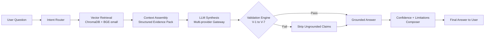
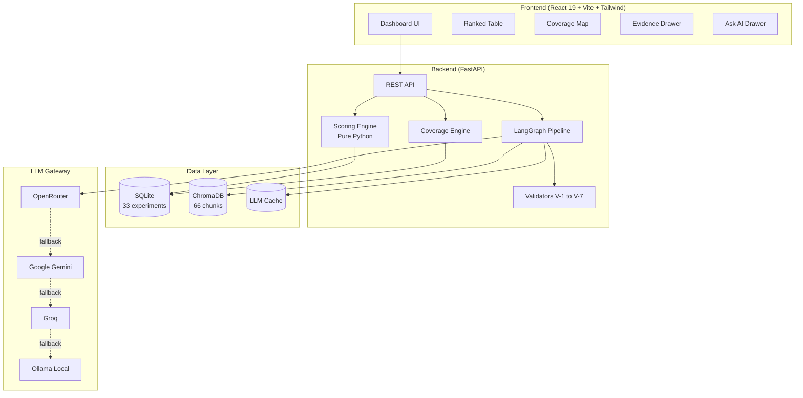

<div align="center">

# 🔥 AegnyxZero

### Evidence-first fire safety for human spaceflight

*From the Latin* ***Aegis*** *(shield) +* ***Ignis*** *(fire) +* ***Zero*** *(zero gravity)*

[](https://www.spaceappschallenge.org/)
[]()
[]()
[](./LICENSE)
[](https://www.python.org/)
[](https://react.dev/)

**Built by Team Turtlers 🐢 for the NASA Space Apps Challenge 2026 (Dhaka Local Event)**

[Problem Statement](#-the-problem) · [Solution](#-the-solution) · [Demo](#-live-demo) · [Architecture](#-architecture) · [Quick Start](#-quick-start) · [Team](#-team-turtlers-)

</div>

---

## 📸 Hero Screenshot


---

## 🚀 The Problem

NASA has run **decades of microgravity combustion experiments** — BASS, Saffire, SoFIE-GEL, drop-tower studies — but the findings are **scattered across PDFs, heterogeneous datasets, and technical reports**. 

When mission planners design a lunar habitat or a Mars transfer vehicle, they face three impossible problems:

1. 🔍 **Discovery is slow.** Comparing two experiments means manually extracting oxygen levels, pressures, and flow rates from hundreds of pages.
2. 🚨 **Generic AI hallucinates numbers.** In a fire-safety context, a hallucinated spread rate is not an error — it is a **fatal safety hazard**.
3. 🕳️ **Nobody can see what was never tested.** The conditions with *zero experimental coverage* are exactly where risk hides — and they are invisible in every existing tool.

> *"We are designing a lunar habitat cabin with 30% oxygen at reduced pressure. Which materials are the biggest fire risks, and how sure are we?"*

This is the question AegnyxZero answers.

---

## 💡 The Solution

**AegnyxZero** is an interactive, AI-assisted **fire-safety decision dashboard** that turns scattered NASA experiments into structured, cited, ranked, and validated safety insights.

| Capability | What It Does |
|-----------|--------------|
| 📊 **Structured Experiment Table** | Turns papers into 33 cited, verified rows from 5 NASA sources |
| 🎯 **Transparent Risk Ranking** | Ranks materials by fire risk using a deterministic, auditable score |
| 🔬 **Evidence Panel** | Every number links back to the exact paper, page, and quote |
| 🗺️ **Coverage Map** | Visualizes untested O₂ × pressure regimes — the gaps where risk hides |
| 🤖 **Grounded Ask AI** | Answers plain-English questions with citations, **never** hallucinations |
| ✅ **Deterministic Validators** | Pure-Python checks (V-1 to V-7) that block ungrounded claims before they reach the user |

**Our one-line pitch:** *We take messy NASA fire experiments, organize them into a table, rank the risks, show the proof, and admit what we don't know.*

---

## 🎬 Live Demo

> 🔗 **[Explore the Interactive Repository](https://github.com/HippomasAKiB1/aegnyxzero)** *(Live web deployment coming soon)*

**Run it locally in 60 seconds** → see [Quick Start](#-quick-start)

---

## 🧠 How It Works

### The Core Principle
> **Code validates. The LLM explains.**

Every AI-generated answer passes through a **deterministic validation engine** *before* it reaches the user. If a number doesn't exist in the cited NASA data, it is **stripped from the response**.

### The Pipeline



### The Validators (The Trust Layer)

| ID | Check | Why It Matters |
|----|-------|----------------|
| **V-1** | Schema conformance | Rejects malformed AI outputs |
| **V-2** | Citation grounding | Every claim must cite a real experiment |
| **V-3** | Number grounding | Every number must exist in cited data |
| **V-4** | Unit sanity | O₂ in [0,100]%, pressure > 0 kPa, etc. |
| **V-5** | Outcome consistency | "Extinguished" can't cite a "sustained spread" row |
| **V-6** | Gravity consistency | Microgravity claims need microgravity evidence |
| **V-7** | Overreach detection | Flags claims outside the data's range |

---

## 🏗️ Architecture



---

## 📚 Data Sources

All 33 experiment rows are curated from **publicly available NASA research** with full attribution:

| Source ID | Investigation | Facility | NTRS / Reference |
|-----------|--------------|----------|------------------|
| `src_bass` | BASS / BASS-II | ISS | NTRS 20150008962, NASA/TM-20210011385 |
| `src_saffire` | Saffire I–VI | Cygnus | NTRS 20170008805, 20210011521, 20240002981 |
| `src_sofie` | SoFIE-GEL | ISS | NASA ISS Research Explorer |
| `src_droptower` | Drop-Tower Studies | NASA Zero-G | NTRS 19880006471 |
| `src_explore` | Exploration Atmospheres | Ground | NASA/TP-2010-216134 |

> **Data provenance is documented in [`data/SOURCES.md`](./data/SOURCES.md).** We store extracted facts and short attributed excerpts — never redistribute full-text PDFs.

---

## 🛠️ Tech Stack

| Layer | Technology |
|-------|-----------|
| **Frontend** | React 19, Vite, TypeScript, Tailwind CSS, Lucide Icons |
| **Backend** | Python 3.11+, FastAPI, SQLAlchemy, Pydantic |
| **AI Pipeline** | LangGraph, LangChain, OpenAI-compatible gateway |
| **Embeddings** | `BAAI/bge-small-en-v1.5` (local, CPU) |
| **Vector DB** | ChromaDB (persistent, embedded) |
| **Relational DB** | SQLite |
| **LLM Providers** | OpenRouter · Google AI Studio · Groq · Ollama (fallback chain) |
| **Testing** | pytest (21 tests) |
| **License** | MIT |

**Total cost to run:** **$0.00** — every component is free, open-source, or free-tier.

---

## ⚡ Quick Start

### Prerequisites
- Python **3.11+**
- Node.js **20+**

### Native Setup

1. **Clone the repository:**
   ```bash
   git clone https://github.com/HippomasAKiB1/aegnyxzero.git
   cd aegnyxzero
   cp .env.example .env
   ```

2. **Ingest data & build vector index:**
   ```bash
   python data_pipeline/load_csv.py
   python data_pipeline/build_index.py
   python data_pipeline/export_snapshot.py
   ```

3. **Start the Backend:**
   ```bash
   cd backend
   pip install -r requirements.txt
   python -m uvicorn app.main:app --reload --port 8000
   ```
   API runs at `http://localhost:8000`. Health check: `http://localhost:8000/health`.

4. **Start the Frontend:**
   ```bash
   cd ../frontend
   npm install
   npm run dev
   ```
   Open **http://localhost:5173** 🎉

### Demo Mode (No API Keys Required)

Set `DEMO_MODE=true` in `.env` — the app runs entirely offline with precomputed answers and bundled snapshot data. Perfect for reviewers and judges.

---

## 🧪 Testing

```bash
cd backend
python -m pytest -v
```

```
========================= 21 passed in ~37s =========================
- test_llm_gateway.py ........... 3 passed
- test_pipeline_v2.py ............ 4 passed
- test_retrieval.py .............. 5 passed
- test_scoring.py ................ 6 passed
- test_validators.py ............. 3 passed
```

Our test suite covers:
- ✅ Deterministic scoring math (TC-S1 to TC-S7)
- ✅ Hallucination blocking (TC-V1, V2, V3, V5)
- ✅ RAG behavior including unanswerable queries (TC-R1, R2, R3, R5)
- ✅ LLM provider fallback chains
- ✅ Vector retrieval accuracy

---

## 📁 Repository Structure

```
aegnyxzero/
├── backend/
│   ├── app/
│   │   ├── main.py              # FastAPI app + endpoints
│   │   ├── scoring.py           # Deterministic risk engine
│   │   ├── coverage.py          # O₂ × pressure grid
│   │   ├── validators.py        # V-1 to V-7 hallucination checks
│   │   ├── retrieval.py         # ChromaDB vector search
│   │   ├── llm_gateway.py       # Multi-provider fallback
│   │   ├── pipeline_v2.py       # LangGraph orchestration
│   │   └── ask_ai.py            # Legacy mock (demo fallback)
│   ├── config/llm.yaml          # Provider configs
│   └── tests/                   # 21 pytest tests
├── frontend/
│   └── src/
│       ├── components/          # RankedTable, EvidenceDrawer, etc.
│       └── App.tsx
├── data_pipeline/
│   ├── load_csv.py              # CSV → SQLite
│   ├── build_index.py           # SQLite → ChromaDB
│   └── export_snapshot.py       # SQLite → snapshot.json
├── data/
│   ├── SOURCES.md               # Attribution log
│   ├── sources.csv
│   └── seed_data.csv            # 33 verified rows
├── PRD.md                       # Full product requirements
├── LICENSE                      # MIT License
└── README.md
```

---

## ⚠️ Limitations & Honest Disclosures

We believe in transparency. AegnyxZero is **decision support**, not certified safety software.

- 🔸 **Solid-material scope only** — Droplet, gaseous-flame, and smoke experiments are on the roadmap.
- 🔸 **Prototype dataset** — 33 rows from 5 sources. Official challenge datasets will be ingested via our adapter layer when released.
- 🔸 **Scoring weights are team assumptions** — Marked as such in the UI. Not NASA-validated values.
- 🔸 **LLM may still err** — But V-1 to V-7 catch and strip ungrounded claims before display.

> **What AegnyxZero cannot tell you** is displayed in a persistent panel in the app.

---

## 🗺️ Roadmap

- [ ] Ingest official NASA Space Apps datasets via adapter layer
- [ ] Image/video evidence gallery with VLM captions
- [ ] Knowledge graph linking materials → conditions → outcomes
- [ ] Expert-feedback-driven RAG tuning (RLHF-ready)
- [ ] Uncertainty calibration studies
- [ ] Additional hazard types (toxic products, smoke aerosols)
- [ ] Production Docker and Docker Compose containerization

---

## 👥 Team Turtlers 🐢

Built with **48 hours of caffeine, curiosity, and code** at the NASA Space Apps Challenge 2026 — Dhaka Local Event.

| Name | Role |
|------|------|
| **Akib Hasan Pyil** | 🧭 Team Leader · Full-Stack Architect · AI Pipeline |
| **Nazat E Rose Rhythm** | 🎨 Frontend & UX |
| **Jafir Islam Siam** | 🧪 Data Curation & QA |
| **Tauhid Sarker** | ⚙️ Backend & API |
| **Arnob Das** | 📊 Data Engineering & Analysis |

---

## 🙏 Acknowledgments

- **NASA Space Apps Challenge** — for the platform and the challenge prompt
- **NASA Physical Sciences Informatics (PSI)** and **NASA Technical Reports Server (NTRS)** — for open access to decades of combustion research
- **The BASS, Saffire, and SoFIE-GEL teams** — whose experiments made this possible
- **Open-source community** — FastAPI, LangChain, ChromaDB, React, Tailwind, and countless others

---

## 📜 License

Released under the **MIT License**. See [LICENSE](./LICENSE) for details.

NASA data is used under public domain / open-access terms with full attribution in [`data/SOURCES.md`](./data/SOURCES.md).

---

<div align="center">

**🔥 Every risk, cited. Every gap, surfaced. Every answer, validated.**

Made with 🐢 by **Team Turtlers** at NASA Space Apps Challenge 2026 — Dhaka

[⬆ Back to Top](#-aegnyxzero)

</div>